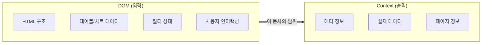
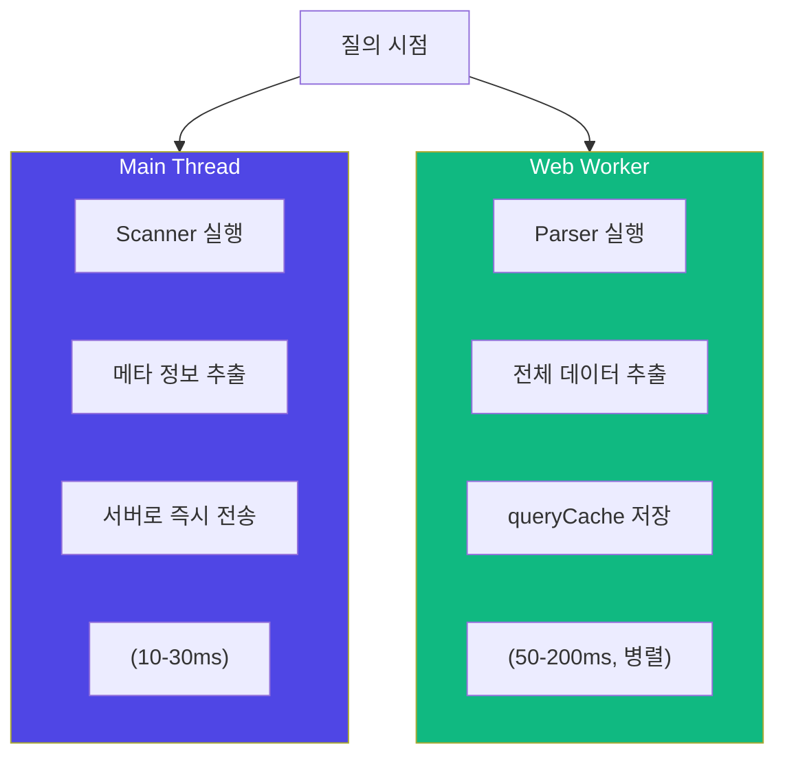
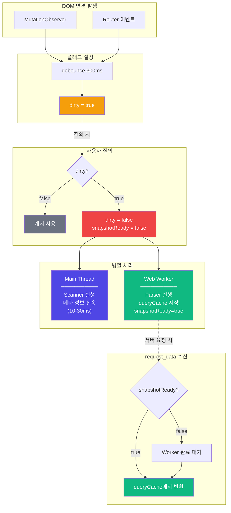
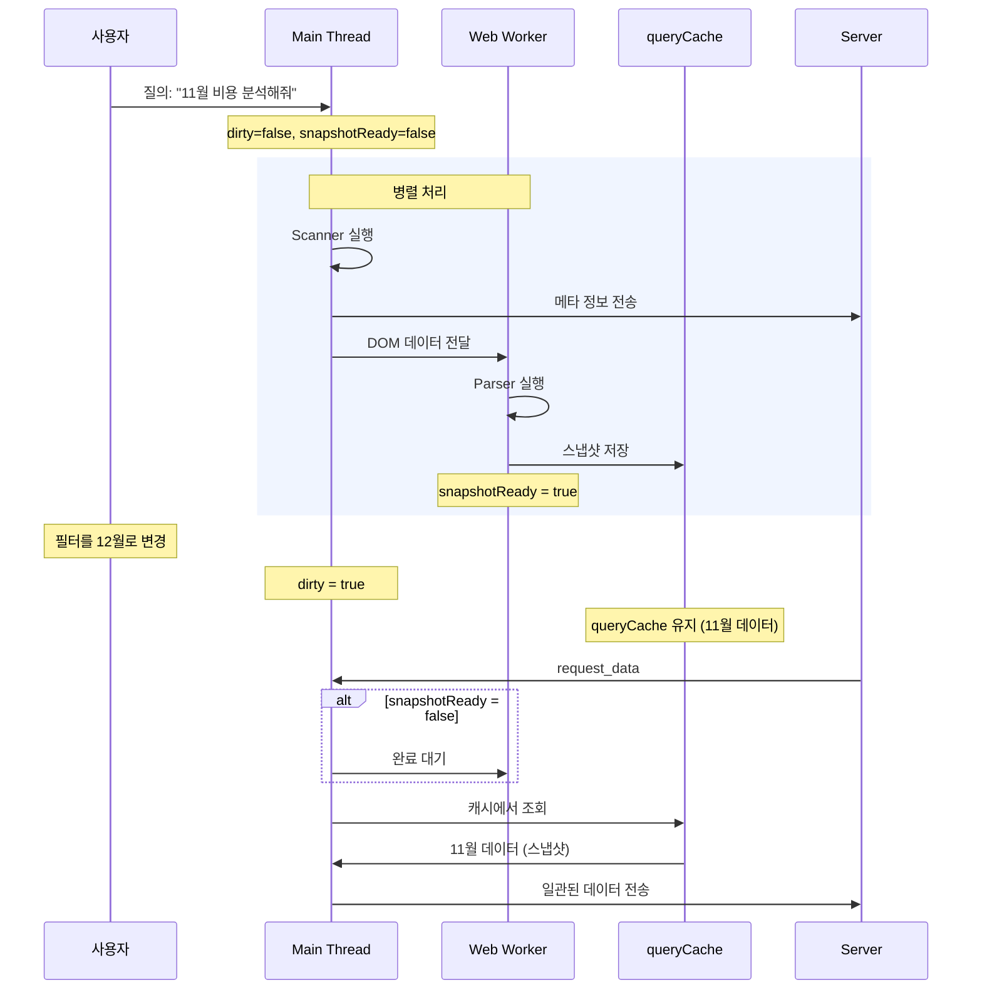
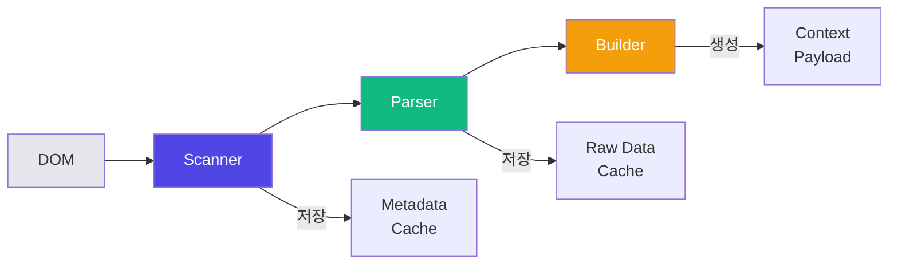
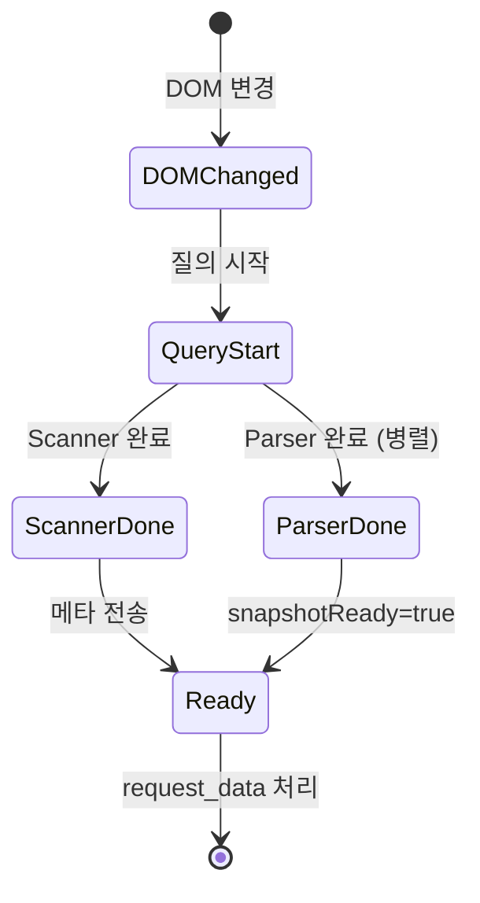
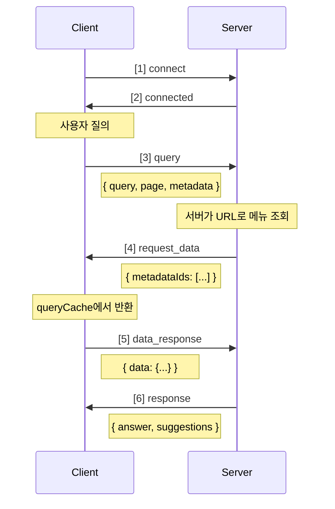
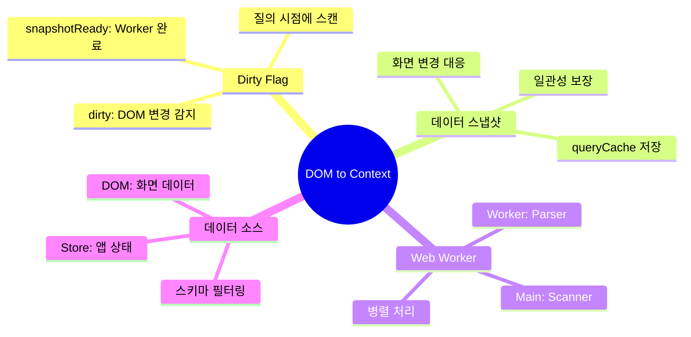

# OpsNow Copilot - DOM to Context 설계서

> DOM에서 LLM 컨텍스트로 변환하는 클라이언트 측 처리 상세 설계

---

## 1. 문서 범위

이 문서는 **클라이언트(브라우저)에서 DOM을 LLM이 이해할 수 있는 컨텍스트로 변환**하는 과정만 다룹니다.



**범위 외**: 서버 측 처리, LLM 프롬프트, RAG, 응답 생성

---

## 2. 매 질의 시 전송하는 정보

사용자가 질의할 때마다 **항상** 다음 정보를 함께 전송합니다:

| # | 항목 | 예시 |
|---|------|------|
| 1 | **사용자 질의** (query) | `"이번 달 비용이 왜 높아졌어?"` |
| 2 | **페이지 정보** (page) | `{ url: "/cost/analysis", title: "비용 분석" }` |
| 3 | **메타 정보 목록** (availableMetadata) | `[{ id: "cost_summary", type: "summary" }, ...]` |

> **Note**
> - 대화 히스토리는 서버에서 Memory as RAG로 관리
> - 메뉴 구조는 서버에서 Platform API로 관리

### 2.1 전송 전략 (Dirty Flag 기반)

| 정보 | 전송 방식 |
|------|----------|
| **메타 정보** | dirty면 새로 스캔, 아니면 캐시 사용 |
| **페이지 정보** | 항상 전송 (현재 맥락 파악에 필수) |

> **메뉴 구조는 서버에서 관리**: 클라이언트는 URL만 전송하고, 서버가 Platform API를 통해 메뉴 정보를 조회합니다.

```
질의 시점:
• dirty === true  → Scanner 실행 (10-30ms) → 새 메타 정보 전송
• dirty === false → 캐시된 메타 정보 즉시 전송 (0ms)
```

### 2.2 대화 맥락 유지

대화 히스토리는 **서버에서 관리**합니다 (Memory as RAG):

```
사용자: "11월 비용 분석해봐"
Copilot: "11월 총 비용은 $45,678이며..."

사용자: "그럼 그 전달은?"
         ↓
서버가 이전 대화에서 "11월"을 찾아 "10월"로 해석
```

- 클라이언트는 히스토리 관리 불필요
- 서버가 벡터 검색으로 관련 대화만 참조
- 토큰 효율성 + 맥락 유지 동시 달성

---

## 3. 사용 기술 및 도구

### 3.1 표준 웹 기술 목록

모든 기술은 **W3C/WHATWG 표준**이며, 모던 브라우저에서 지원됩니다.

| 기술 | 표준 | 용도 | 브라우저 지원 |
|------|------|------|--------------|
| **DOM API** | WHATWG DOM | 요소 탐색, 속성 읽기 | 모든 브라우저 |
| **TreeWalker** | DOM Level 2 | 효율적 DOM 순회 | IE9+ |
| **MutationObserver** | DOM Level 4 | DOM 변경 감지 | IE11+ |
| **Web Workers** | HTML5 | 메인 스레드 분리 처리 | IE10+ |
| **Intersection Observer** | W3C | 요소 가시성 감지 | Edge 15+ |
| **ResizeObserver** | W3C | 요소 크기 변경 감지 | Chrome 64+ |
| **WebSocket** | RFC 6455 | 실시간 양방향 통신 | IE10+ |

### 3.2 Web Worker 상세 (필수)

Web Worker는 **HTML5 표준**이며, **데이터 일관성 보장을 위해 필수**입니다.

> **문제**: LLM 응답 대기 중 (10-30초) 사용자가 화면을 변경하면?
> - 질의 시점 메타 정보와 현재 DOM 데이터 불일치
> - LLM이 잘못된 데이터로 응답 생성



**장점**:
- ✅ 데이터 일관성 보장: 질의 시점 스냅샷
- ✅ UI 블로킹 없음: 메타 전송 후 바로 화면 조작 가능
- ✅ 병렬 처리: 메타 전송과 데이터 추출 동시 진행

**제약**:
- ⚠️ DOM 직접 접근 불가 → Main에서 DOM 읽어서 Worker로 전달
- ⚠️ postMessage 통신 오버헤드 (수 ms)

#### 역할 분담

| Main Thread | Worker Thread |
|-------------|---------------|
| UI 렌더링 | 데이터 파싱/정제 |
| 사용자 인터랙션 | Markdown 변환 |
| DOM 접근 (Scanner) | 토큰 추정 |
| 이벤트 처리 | queryCache 관리 |
| WebSocket 통신 | |

| 방향 | 전달 내용 |
|------|----------|
| **Main → Worker** | DOM에서 읽은 원시 데이터, 메타 정보 |
| **Worker → Main** | 파싱 완료된 구조화 데이터, 저장 완료 신호 |

### 3.3 기술 선택 기준

#### DOM 순회 방식

| 방식 | 기술 | 사용 케이스 |
|------|------|-------------|
| 단순 탐색 | `querySelectorAll` | 특정 셀렉터 매칭 |
| 깊은 순회 | `TreeWalker` | 전체 DOM 순회 (더 효율적) |
| 조건부 탐색 | `document.evaluate` | XPath 기반 복잡한 조건 |

#### 변경 감지 방식

| 감지 대상 | 기술 |
|-----------|------|
| DOM 구조 변경 | `MutationObserver` |
| URL 변경 | `popstate` + Router 이벤트 |
| 요소 가시성 | `IntersectionObserver` |

#### 처리 위치

| 작업량 | 처리 위치 |
|--------|-----------|
| 경량 (< 100 요소) | Main Thread |
| 중량 (100+ 요소) | Web Worker |

---

## 4. DOM to Context 처리 파이프라인

### 4.1 Dirty Flag 기반 처리 (핵심)



**왜 이 방식인가?**
- **단순함**: 복잡한 사전 스캔/타이머 로직 불필요
- **효율성**: 질의 없으면 스캔도 없음 (불필요한 작업 제거)
- **일관성**: 질의 시점 데이터 스냅샷으로 응답 중 화면 변경 대응

**왜 두 개의 플래그인가?**
- `dirty`: DOM 변경 여부 (Scanner 시작 조건)
- `snapshotReady`: Worker 완료 여부 (데이터 요청 가능 조건)
- 병렬 실행이므로 Scanner 완료 ≠ Parser 완료

### 4.2 데이터 일관성 보장 (스냅샷)

**문제 상황**: LLM 응답 대기 중 (10-30초) 사용자가 화면을 변경하면?



**해결 방식**:
- **이후 화면 변경**: `dirty = true` (다음 질의용), 현재 queryCache는 유지
- **request_data 수신 시**: queryCache에서 반환 (현재 DOM 무시) → 일관된 데이터 보장

### 4.3 전체 파이프라인



| 단계 | 역할 | 트리거 | 결과 |
|------|------|--------|------|
| **Scanner** | DOM 스캔 → 메타 정보 추출 | 질의 시 dirty면 실행 | Metadata Cache |
| **Parser** | 요청된 메타 ID → 실제 데이터 추출 | LLM이 요청한 메타 정보만 처리 | Raw Data |
| **Builder** | 데이터 → LLM 컨텍스트 조립 | Markdown 변환, 토큰 제한 적용 | Context Payload |

### 4.4 단계별 상세

#### Stage 1: Scanner (질의 시 dirty면 실행)

> **트리거**: 사용자 질의 시점에 `dirty === true`인 경우

**1. 컨테이너 영역 식별** (자동 감지)
- 시맨틱 태그: `main`, `section`, `article`
- 클래스 패턴: `.content`, `.page-*`, `.view-*`
- 구조 패턴: 헤더 + 본문 영역

**2. 데이터 영역 분류** (자동 감지)

| 유형 | 식별 방법 |
|------|-----------|
| `summary` | 카드 형태, 큰 숫자, 증감 표시 |
| `table` | `<table>`, `.ag-root-wrapper` (AG-Grid) |
| `chart` | `.amcharts-main-div` (amCharts5) |
| `filter` | `<select>`, DatePicker, 필터 컨테이너 |
| `metric` | 단일 수치 표시 영역 |

**3. 메타 정보 생성**

```typescript
{
  id: "cost_by_service",
  type: "table",
  sources: ["dom", "store"],
  label: "서비스별 비용",
  description: "AWS 서비스별 비용 내역 테이블",
  storePath: "cost/serviceList",
  estimatedTokens: 800,
  schema: {
    fields: [
      { name: "serviceName", type: "string", label: "서비스" },
      { name: "cost", type: "number", unit: "USD" },
      { name: "change", type: "number", unit: "%" }
    ],
    rowCount: 25
  }
}
```

> **출력**: MetadataRegistry (항상 준비 상태)

#### Stage 2: Parser (LLM 데이터 요청 시)

> **트리거**: 서버로부터 `{ type: "request_data", metadataIds: [...] }` 수신

| 유형 | 처리 방법 | 결과 |
|------|-----------|------|
| **Summary** | 제목, 주요 수치, 증감률 추출 | `{ title, value, change, period }` |
| **Table** | AG-Grid: `gridApi.getRenderedNodes()`, HTML: `<tr>`, `<td>` 순회 | `{ headers: [], rows: [[]] }` |
| **Chart** | amCharts5: `series.data` 추출, Canvas: 메타 정보만 | `{ type, labels: [], datasets: [] }` |
| **Filter** | 현재 선택값 (기간, 벤더, 계정 등) 추출 | `{ period: "2024-11", vendor: "aws" }` |

> **출력**: Raw Data Cache

#### Stage 3: Builder (컨텍스트 조립)

**1. Markdown 변환**

```
## 서비스별 비용
- EC2: $12K (+5%)
- S3: $3K (-2%)
- RDS: $8K (+12%)
```

**2. 토큰 제한 적용**
- 최대 토큰 한도 체크
- 초과 시 행 수 축소 또는 요약

**3. 최종 조립**

```json
{
  "data": {
    "cost_summary": "## 비용 요약\n총 비용: $45,678...",
    "cost_table": "| 서비스 | 비용 |..."
  },
  "totalTokens": 1250
}
```

> **출력**: Context Payload (서버로 전송)

---

## 5. 메타 정보 추출 전략

### 5.1 자동 감지 기반 추출 (사용자 수정 불필요)

> **원칙**: 기존 코드 수정 없이 자동 감지

| 감지 방식 | 패턴 |
|-----------|------|
| **컴포넌트 클래스** | AG-Grid: `.ag-root-wrapper`, `.ag-theme-*`<br/>amCharts5: `.amcharts-main-div`, `[id*="chartdiv"]`<br/>테이블: `<table>`, `.data-table` |
| **구조/레이아웃** | 요약 카드: 큰 숫자 + 라벨 + 증감률<br/>필터 영역: `<select>`, `input[type="date"]`<br/>메트릭: 단일 수치 + 단위 |
| **시맨틱 태그** | `<main>`, `<section>`, `<article>`<br/>`<table>`, `<thead>`, `<tbody>`<br/>`<h1>`-`<h6>` 제목 요소 |
| **텍스트 패턴** | 금액: `$`, `₩`, `USD`, `KRW` + 숫자<br/>퍼센트: 숫자 + `%`<br/>날짜: `YYYY-MM`, `MM월` |

### 5.2 컴포넌트별 추출 방법

| 컴포넌트 | 감지 | 메타 | 데이터 |
|----------|------|------|--------|
| **AG-Grid 테이블** | `.ag-root-wrapper`, `.ag-theme-*` | 컬럼 정의, 행 수, 정렬/필터 상태 | `gridApi.getRenderedNodes()` 또는 DOM 파싱 |
| **amCharts5 차트** | `.amcharts-main-div`, `[id*="chartdiv"]` | 차트 타입, 시리즈 수, 데이터 포인트 수 | `am5.registry.rootElements` → `series.data` |
| **요약 카드** | 카드 컨테이너 내 [수치 + 라벨 + 증감] 패턴 | 제목, 값 유형 (금액/퍼센트/개수) | 텍스트 노드에서 숫자/퍼센트 추출 |
| **필터 영역** | `<select>`, `input[type="date"]`, `.filter-*` | 필터 종류, 현재 선택값 | 선택된 값, 날짜 범위 추출 |

### 5.3 데이터 소스 (DOM vs Store)

#### `sources: ["dom"]` - 화면 데이터

| 특징 | 설명 |
|------|------|
| 대상 | 화면에 렌더링된 데이터 |
| 특성 | 필터/정렬 적용된 결과, 사용자가 실제로 보는 것 |

```typescript
{ id: "cost_table", type: "table", sources: ["dom"] }
{ id: "cost_chart", type: "chart", sources: ["dom"] }
```

#### `sources: ["store"]` - 앱 상태

| 특징 | 설명 |
|------|------|
| 대상 | 상태 관리 store에 저장된 원본 데이터 |
| 특성 | API 응답 결과, 앱 컨텍스트 (벤더, 회사 등) |
| 프레임워크 | Vuex, Pinia, Redux, MobX 등 |

```typescript
{ id: "selected_vendor", type: "context", sources: ["store"], storePath: "internalCommon/selectedVendor" }
{ id: "data_ingest", type: "context", sources: ["store"], storePath: "internalCommon/dataIngest" }
```

#### `sources: ["dom", "store"]` - 복수 소스

- 여러 소스에서 데이터 제공 가능
- 원본 vs 필터링된 데이터 비교 분석 가능
- 향후 다른 소스 추가 가능 (예: `"api"`, `"cache"`)

#### LLM 요청 시 소스 선택

| 사용자 요청 | preferredSources |
|-------------|------------------|
| "화면에 보이는 데이터 분석해줘" | `["dom"]` |
| "원본 데이터 보여줘" | `["store"]` |
| "필터 전후 비교해줘" | `["dom", "store"]` |

### 5.4 앱 상태 (Store) 주요 데이터

> **Note**: 상태 관리 라이브러리별 접근 방식이 다름
> - Vue: Vuex, Pinia
> - React: Redux, MobX, Zustand, Recoil
> - 구현 시 해당 프레임워크에 맞게 어댑터 구현 필요

| 모듈/슬라이스 | 데이터 | 설명 |
|---------------|--------|------|
| `internalCommon` | `selectedVendor` | 선택된 벤더 |
| | `dataIngest` | 수집 상태 |
| | `statusAutoSavings` | 절감 상태 |
| `common` | `vendors` | 벤더 목록 |
| | `companyList` | 회사 목록 |
| | `homepageInfo` | 홈 정보 |
| `overview` | `monthlyBilled` | 월별 청구 |
| `budget` | `budgetList` | 예산 목록 |
| `cost` | (비용 분석 데이터) | 비용 관련 |

> **storePath 형식**: `{모듈명}/{상태명}` 또는 `{모듈명}/{getter명}`

---

## 6. 화면 변경 감지 (Dirty Flag)

### 6.1 핵심 원칙

> **원칙**: 변경 감지만 하고, 스캔은 질의 시점에

| 동작 | 설명 |
|------|------|
| DOM 변경 | `dirty = true` (이게 전부) |
| 스캔/파싱 | 하지 않음 |
| 질의 시점 | dirty 체크 → dirty면 그때 스캔 |

**장점**:
- ✅ 사용자가 화면을 계속 변경해도 부하 없음
- ✅ 질의 없으면 작업도 없음
- ✅ 단순하고 예측 가능한 동작

### 6.2 감지 이벤트

| 이벤트 소스 | 기술 | 처리 |
|-------------|------|------|
| 페이지 이동 (URL 변경) | Router 이벤트, `popstate` | `dirty = true` |
| 탭/필터 변경 (DOM 구조 변경) | `MutationObserver` | `dirty = true` |
| 데이터 갱신 (API 응답) | 명시적 이벤트 `copilot:data-loaded` | `dirty = true` |
| 모달/팝업 | `MutationObserver` | `dirty = true` |

**Debounce 적용**:
- 300ms 대기 후 `dirty = true` 설정
- 연속 변경 시 마지막 1회만 플래그 설정
- 스캔은 하지 않음 (질의 시점까지 대기)

### 6.3 상태 관리

#### 상태 구조

```typescript
{
  dirty: boolean,           // DOM 변경 여부
  snapshotReady: boolean,   // queryCache 준비 완료 여부
  metadataCache: Metadata[],// 캐시된 메타 정보
  queryCache: Map<id, data> // 질의 시점 데이터 스냅샷
}
```

#### 상태 전이

| 시점 | dirty | snapshotReady | 동작 |
|------|-------|---------------|------|
| **초기화** | `true` | `false` | 앱 시작 |
| **DOM 변경** | `true` | 유지 | 진행중인 질의 보호 |
| **질의 시작** | `false` | `false` | Scanner(Main) + Parser(Worker) 시작 |
| **Parser 완료** | - | `true` | queryCache 사용 가능 |
| **request_data** | - | 체크 | `false`면 Worker 완료 대기 후 캐시에서 반환 |

#### 왜 두 개의 플래그가 필요한가?

| 문제 | 해결 |
|------|------|
| Scanner(Main)와 Parser(Worker)가 병렬 실행 | `dirty`: Scanner 시작 조건 |
| Scanner 완료 ≠ Parser 완료 | `snapshotReady`: 데이터 요청 조건 |
| dirty만 쓰면 Parser 완료 전 새 질의 가능 | 두 플래그로 시점 분리 |



### 6.4 MutationObserver 설정

#### 관찰 옵션

```javascript
{
  childList: true,      // 자식 노드 추가/제거
  subtree: true,        // 하위 전체 관찰
  attributes: true,     // 속성 변경
  attributeFilter: [    // 관심 속성만
    'class',            // 탭/상태 변경
    'style',            // display 변경 (탭 전환)
    'hidden'            // 표시/숨김
  ]
}
```

| 설정 | 값 |
|------|---|
| **관찰 범위** | `#app` 또는 `main` 컨테이너, Copilot Widget 영역 제외 |
| **필터링** | 스타일 변경만 있는 경우 무시, 데이터 영역 변경만 dirty 플래그 설정 |

---

## 7. 메뉴 구조 관리 (서버 측)

### 7.1 관리 주체

| 역할 | 책임 |
|------|------|
| **클라이언트** | 현재 URL만 전송 (`page.url: "/cost/analysis"`), 메뉴 구조 관리/전송 불필요 |
| **서버** | Platform API로 메뉴 구조 캐싱, URL로 현재 위치 파악, Fallback 시 메뉴 안내, 관련 메뉴 추천 |

**장점**:
- ✅ 클라이언트 부담 감소
- ✅ 메뉴 구조 변경 시 클라이언트 수정 불필요
- ✅ 권한별 메뉴 필터링 서버에서 처리

### 7.2 서버의 메뉴 정보 활용

#### 서버가 관리하는 메뉴 정보

```json
{
  "current": {
    "path": "/cost/analysis",
    "name": "비용 분석",
    "breadcrumb": ["비용 관리", "비용 분석"]
  },
  "siblings": [
    { "path": "/cost/dashboard", "name": "비용 대시보드" },
    { "path": "/cost/report", "name": "비용 리포트" }
  ],
  "related": [
    { "path": "/budget", "name": "예산 관리", "relation": "예산 비교" },
    { "path": "/optimization/ri", "name": "RI 추천", "relation": "절감" }
  ]
}
```

| 항목 | 설명 |
|------|------|
| **획득 방법** | Platform API를 통해 주기적 갱신, 서버 시작 시 로드 후 인메모리 캐싱 |
| **갱신 시점** | 서버 시작 시, 주기적 갱신 (1시간 등), 메뉴 변경 이벤트 수신 시 |

---

## 8. 데이터 흐름 (WebSocket 기반)

### 8.1 전체 시퀀스



### 8.2 메시지 타입 정의

#### Client → Server

**query** (질의)
```typescript
{
  type: "query",
  query: string,
  page: { url: string, title: string, vendor?: string },
  availableMetadata: MetadataItem[]
}
// 메뉴 구조는 서버가 page.url을 기반으로 Platform API에서 조회
```

**data_response** (데이터 응답)
```typescript
{
  type: "data_response",
  requestId: string,
  data: Record<string, any>
}
```

**api_result** (API 호출 결과)
```typescript
{
  type: "api_result",
  requestId: string,
  success: boolean,
  data?: any,
  error?: string
}
```

#### Server → Client

**request_data** (데이터 요청)
```typescript
{
  type: "request_data",
  requestId: string,
  metadataIds: string[],
  preferredSources?: string[],  // ["dom"], ["store"], ["dom", "store"]
  options?: {
    fields?: string[],    // 추출할 필드 목록
    filter?: object,      // 필터 조건 (예: { vendor: "aws" })
    limit?: number        // 최대 행 수
  }
}
```

> **Note**: `options`는 스키마 기반 필터링 (LLM이 schema 정보 참고하여 구성)

**request_api** (API 호출 요청)
```typescript
{
  type: "request_api",
  requestId: string,
  endpoint: string,
  method: "GET" | "POST",
  params?: object
}
```

**response** (응답)
```typescript
{
  type: "response",
  answer: string,
  suggestions?: Suggestion[],
  sources?: string[]
}
```

---

## 9. 타입 정의

### 9.1 메타 정보 타입

#### MetadataItem

| 필드 | 타입 | 설명 |
|------|------|------|
| `id` | `string` | 고유 식별자 (예: `"cost_by_service"`) |
| `type` | `MetadataType` | `summary` \| `table` \| `chart` \| `filter` \| `metric` \| `context` |
| `sources` | `DataSource[]` | 데이터 소스 배열 (예: `["dom"]`, `["store"]`) |
| `label` | `string` | 사람이 읽을 수 있는 이름 |
| `description` | `string` | LLM이 이해할 수 있는 설명 |
| `estimatedTokens` | `number` | 예상 토큰 수 |
| `schema?` | `{ fields, rowCount }` | 테이블/차트 스키마 |
| `chartType?` | `string` | `line` \| `bar` \| `pie` 등 |
| `filterType?` | `string` | `date` \| `select` \| `multi-select` |
| `storePath?` | `string` | 상태 경로 (예: `"internalCommon/selectedVendor"`) |

#### FieldInfo

| 필드 | 타입 | 설명 |
|------|------|------|
| `name` | `string` | 필드명 (예: `"serviceName"`) |
| `type` | `FieldType` | `string` \| `number` \| `boolean` \| `date` \| `array` \| `object` |
| `label?` | `string` | 표시명 (예: `"서비스"`) |
| `unit?` | `string` | 단위 (예: `"USD"`, `"%"`) |
| `values?` | `string[]` | 가능한 값 목록 (enum 타입인 경우) |
| `format?` | `string` | 포맷 (예: `"YYYY-MM"`, `"currency"`) |

#### 기타 타입

| 타입 | 정의 |
|------|------|
| `MetadataType` | `"summary"` \| `"table"` \| `"chart"` \| `"filter"` \| `"metric"` \| `"context"` |
| `DataSource` | `"dom"` (화면 데이터) \| `"store"` (앱 상태) |
| `FieldType` | `"string"` \| `"number"` \| `"boolean"` \| `"date"` \| `"array"` \| `"object"` |

### 9.2 스키마 예시

```json
{
  "id": "cost_by_service",
  "type": "table",
  "sources": ["dom", "store"],
  "label": "서비스별 비용",
  "storePath": "cost/serviceList",
  "schema": {
    "fields": [
      { "name": "serviceName", "type": "string", "label": "서비스" },
      { "name": "cost", "type": "number", "label": "비용", "unit": "USD" },
      { "name": "change", "type": "number", "label": "증감", "unit": "%" },
      { "name": "vendor", "type": "string", "label": "벤더", "values": ["aws", "azure", "gcp"] }
    ],
    "rowCount": 25
  }
}
```

**장점**:
- ✅ DOM 테이블과 Store 데이터 동일 구조
- ✅ LLM이 필드 정보로 필터/선택 요청 가능
- ✅ enum 값 제공으로 정확한 필터 조건 구성
- ✅ 토큰 추정 정확도 향상

### 9.3 메뉴 구조 타입 (서버 측)

> 메뉴 구조는 서버에서 관리합니다. 클라이언트는 `page.url`만 전송하고, 서버가 이를 기반으로 메뉴 정보를 조회합니다.

#### MenuStructure

| 필드 | 타입 | 설명 |
|------|------|------|
| `current` | `{ path, name, breadcrumb }` | 현재 위치 정보 |
| `siblings` | `MenuItem[]` | 동일 레벨 메뉴 |
| `related` | `RelatedMenu[]` | 관련 메뉴 (교차 분석) |

#### MenuItem / RelatedMenu

| 필드 | 타입 | 설명 |
|------|------|------|
| `path` | `string` | URL 경로 |
| `name` | `string` | 메뉴 이름 |
| `relation` | `string` | (RelatedMenu만) 관계 설명 (예: "예산 비교", "절감 추천") |

### 9.4 제안 타입

#### Suggestion

| 필드 | 타입 | 설명 |
|------|------|------|
| `type` | `string` | `"analysis"` \| `"menu"` \| `"action"` |
| `text` | `string` | 표시 텍스트 |
| `metadataId?` | `string` | analysis: 추가 분석할 메타 ID |
| `url?` | `string` | menu: 이동할 URL |
| `action?` | `string` | action: 실행할 액션 |

---

## 10. 핵심 정리



| 설계 결정 | 설명 |
|-----------|------|
| **Dirty Flag (2개)** | `dirty`: DOM 변경 감지 (Scanner 시작), `snapshotReady`: Worker 완료 감지 (데이터 요청 조건) |
| **데이터 스냅샷** | LLM 응답 대기 중 화면 변경 대응, queryCache에서 반환하여 일관성 보장 |
| **Web Worker 필수** | Main: Scanner (메타) → 서버 전송, Worker: Parser (데이터) → queryCache 저장 (병렬) |
| **질의 시 전송** | 메타 정보 + 페이지 정보, 메뉴 구조는 서버가 URL로 조회 |
| **대화 히스토리** | 서버에서 관리 (Memory as RAG), 클라이언트 부담 감소 |
| **데이터 소스 구분** | `sources: ["dom"]`, `["store"]`, `["dom", "store"]` 배열, LLM이 선택 가능 |
| **스키마 기반 필터링** | 메타 정보에 schema 포함, options로 fields/filter/limit 지정 |
| **표준 기술** | DOM API, MutationObserver, Web Workers, WebSocket |

